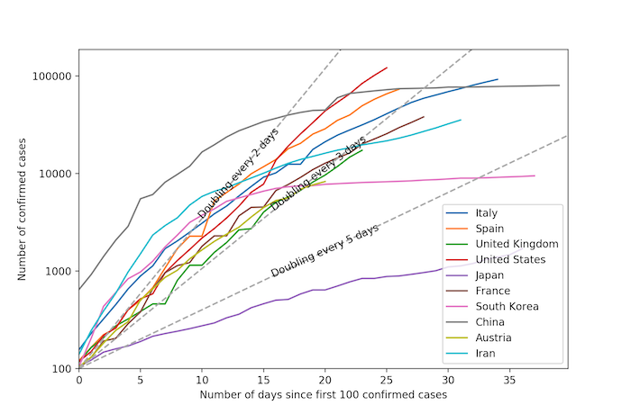

# covid-19
A short script for plotting COVID-19 case number trend lines and bar charts.

More details [on original authors (xnx) scipython.com blog article page](https://scipython.com/blog/plotting-covid-19-case-growth-charts/).

